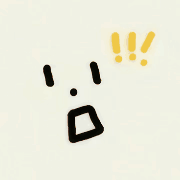

# 圆屏表情代码说明

本文说明老人陪伴对话机器人在 `ESP32-S3-Touch-AMOLED-1.43C` 圆屏上的表情实现、状态调用链，以及学生绘制表情素材的存放和使用方式。

## 当前实现概览

- 显示设备：466 × 466 像素圆形 AMOLED。
- 图形框架：LVGL 9。
- 当前运行方式：用 LVGL 对象绘制眼睛、嘴巴、符号和文字，再通过 `lv_anim`、`lv_timer` 产生动态效果。
- 当前表情不是逐帧播放 GIF 或 MP4；程序会根据机器人状态实时组合表情。
- 学生绘制的惊讶表情保存在 [`esp32-firmware/main/assets/surprise.gif`](../esp32-firmware/main/assets/surprise.gif)，作为设计原稿和后续动画资源保留。



## 代码位置

| 文件 | 作用 |
| --- | --- |
| `esp32-firmware/main/ui/ui_board_amoled18.c` | 表情的核心实现；文件名是旧 1.8 英寸版本遗留，文件内容已经适配 1.43C 圆屏。 |
| `esp32-firmware/main/ui/ui_states.c` | 接收机器人状态变化，并转交给屏幕适配层。 |
| `esp32-firmware/main/ui/ui_faces.c` | 接收独立的表情名称和强度，例如 `happy`、`surprised`。 |
| `esp32-firmware/main/ui/ui_main.c` | 初始化 UI，并用互斥锁保护 LVGL 调用。 |
| `esp32-firmware/main/ui/ui_board.h` | UI 与具体显示硬件之间的接口。 |
| `esp32-firmware/main/app_state.h` | 定义机器人可用的 15 种状态。 |
| `esp32-firmware/main/app_state.c` | 保存当前状态，并通知 UI 更新。 |
| `esp32-firmware/components/elder_round_bsp/elder_round_bsp.c` | 初始化 SH8601 圆屏、QSPI、LVGL 显示任务和亮度控制。 |
| `esp32-firmware/main/protocol/protocol.c` | 解析树莓派发来的 JSON Lines 指令。 |
| `esp32-firmware/main/app_main.c` | 固件入口，负责启动 UI、状态机、通信和硬件测试。 |

## 核心函数

核心文件 `ui_board_amoled18.c` 中的重要函数如下：

| 函数 | 作用 |
| --- | --- |
| `build_face()` | 创建圆形画布、左右眼、眼睛高光、嘴巴、状态符号、文字和动画装饰。 |
| `apply_state()` | 把机器人状态映射为具体表情。 |
| `set_eyes()` | 设置眼睛大小、位置和颜色。 |
| `set_mouth()` | 切换微笑、难过、平嘴、圆嘴、说话嘴型等模式。 |
| `expr_neutral()` | 待机时的温和中性表情。 |
| `expr_happy()` | 识别到用户时的开心表情。 |
| `expr_sad()` | 网络或 API 出错时的难过表情。 |
| `surprise_begin()` | 启动两阶段惊讶动画，并在结束后恢复原状态。 |
| `ui_board_show_state()` | 状态表情的硬件层入口。 |
| `ui_board_show_face()` | 独立表情指令的硬件层入口。 |
| `ui_board_play_boot_animation()` | 开机时播放惊讶动画。 |

## 启动调用链

```text
app_main()
  -> ui_init()
  -> ui_board_init()
  -> bsp_display_start()
  -> build_face()
  -> app_state_set_listener(ui_on_state_changed)
  -> ui_play_boot_animation()
  -> surprise_begin()
  -> APP_STATE_IDLE
```

树莓派改变表情时的调用链：

```text
树莓派发送 JSON Lines 状态消息
  -> usb_serial 接收一行 JSON
  -> protocol_handle_line()
  -> app_state_set()
  -> ui_on_state_changed()
  -> ui_show_state()
  -> ui_board_show_state()
  -> apply_state()
```

板载录音回放测试也会直接切换状态：

```text
LISTENING（开始收音）
  -> SPEAKING（回放录音）
  -> COMFORT（完成提示）
  -> IDLE（回到待机）
```

## 状态与表情对应关系

| 状态 | 屏幕表现 | 动态效果 |
| --- | --- | --- |
| `BOOTING` | 双眼从细线开始 | 随后进入惊讶开机动画 |
| `IDLE` | 竖向胶囊眼、轻微微笑 | 随机眨眼 |
| `FACE_SCANNING` | 青色眼睛、平嘴 | 双眼左右扫描 |
| `USER_RECOGNIZED` | 笑眼、暖色微笑 | 静态欢迎表情 |
| `UNKNOWN_USER` | 中性友好表情 | 随机眨眼 |
| `LISTENING` | 眼睛睁大、小圆嘴 | 表示麦克风已经开始收音 |
| `THINKING` | 较窄眼睛、平嘴 | 省略号循环变化 |
| `SPEAKING` | 普通眼睛、暖色嘴巴 | 嘴巴持续开合 |
| `CONFUSED` | 大小不对称的眼睛、问号 | 静态疑惑表情 |
| `COMFORT` | 笑眼、暖色微笑 | 温和安慰表情 |
| `PRIVACY_MIC_OFF` | 中性脸、静音符号 | 静态隐私提示 |
| `PRIVACY_CAMERA_OFF` | 中性脸、闭眼符号 | 静态隐私提示 |
| `NETWORK_ERROR` | 难过嘴、网络符号 | 静态错误提示 |
| `API_ERROR` | 难过嘴、警告符号 | 静态错误提示 |
| `LOW_POWER` | 困倦细眼、平嘴 | 屏幕亮度降低到 15% |

## 可直接调用的表情名称

`ui_board_show_face()` 当前支持：

- `smile`、`happy`
- `sad`
- `surprised`
- `confused`
- `comfort`、`gentle`

表情强度 `intensity` 的有效范围是 `0.0` 到 `1.0`。当前它主要影响部分线条粗细；惊讶动画使用固定的两阶段时序。

示例消息：

```json
{"type":"state","state":"THINKING"}
```

```json
{"type":"face","emotion":"surprised","intensity":1.0}
```

每条 JSON 后必须跟一个换行符，且普通 ESP-IDF 日志不能混入该 JSON Lines 通道。

## 学生绘制的惊讶表情

资源文件：`esp32-firmware/main/assets/surprise.gif`

- 格式：GIF 89a。
- 尺寸：368 × 368 像素。
- 内容：浅色背景、黑色眼睛和张嘴表情、黄色感叹号。
- 用途：设计原稿、评审参考和以后制作逐帧动画的源素材。

当前固件没有引用 `surprise.gif`，CMake 也没有通过 `EMBED_FILES` 把它嵌入固件。因此：

1. 把 GIF 提交到 GitHub，会保存学生作品并方便队友查看；
2. 当前开发板上显示的惊讶表情，仍是 `surprise_small()` 和 `surprise_large()` 用 LVGL 重绘的矢量版本；
3. 仅修改 GIF 文件不会自动改变开发板画面。

如果以后决定直接播放 GIF，需要新增资源嵌入、启用 LVGL GIF 解码、处理圆屏缩放和内存占用，并在状态切换时正确释放解码对象。在此之前，保留程序化矢量动画更节省存储和运行内存。

## 修改或增加表情的方法

### 调整现有表情

在 `ui_board_amoled18.c` 的 `apply_state()` 中找到目标状态，然后调整：

- `set_eyes()` 的宽度、高度、纵向位置和颜色；
- `set_mouth()` 的嘴型、颜色和线宽；
- `set_texts()` 的符号或中文提示；
- `lv_anim` 的时长、范围、缓动方式和循环次数。

所有尺寸优先使用 `FD(...)` 按圆形画布比例换算，不要直接写死只适用于某个分辨率的坐标。

### 增加新状态表情

1. 在 `app_state.h` 增加状态枚举；
2. 在 `app_state.c` 增加状态名称；
3. 在 `protocol.c` 保持状态消息校验兼容；
4. 在 `apply_state()` 增加对应绘制逻辑；
5. 在树莓派后端状态机中增加合法转换；
6. 编译并在真机上验证切换、恢复和动画资源释放。

### 增加独立表情名称

如果表情不需要成为完整业务状态，只需在 `ui_board_show_face()` 中增加名称分支，并通过 `face` 消息调用。未知名称会回退到中性表情并返回不支持。

## 构建验证

项目使用 ESP-IDF 5.5.3。进入固件目录并加载 ESP-IDF 环境后执行：

```bash
idf.py build
```

成功构建只证明代码和依赖可以生成固件；屏幕裁切、颜色、动画流畅度以及表情是否符合设计稿，仍需要在真实 `ESP32-S3-Touch-AMOLED-1.43C` 上检查。

## 已知遗留项

- `ui_board_amoled18.c/.h` 的文件名来自旧 1.8 英寸方屏版本，内容已经是 1.43C 圆屏实现；后续可单独重命名，避免队友误解。
- `docs/AMOLED18-表情联调记录.md` 记录的是旧方屏阶段，不代表当前圆屏实现。
- 当前仓库没有保存可证明开发板最后一次烧录来源的 `build/`、`sdkconfig` 或固件二进制；这些生成物按设计由 `.gitignore` 排除。
